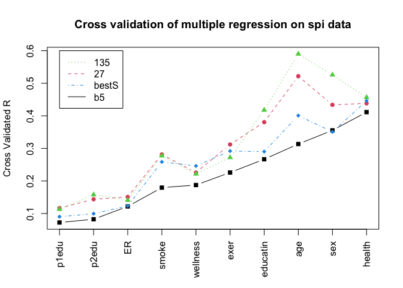

Persome Analyses and Results
================
Elizabeth Dworak

-   [Overview](#overview)
-   [A1. Reliability analyses for the SPI data
    set](#a1-reliability-analyses-for-the-spi-data-set)
    -   [Find alpha and omega for each
        scale](#find-alpha-and-omega-for-each-scale)
    -   [Find the scale scores for the Big 5 and little
        27](#find-the-scale-scores-for-the-big-5-and-little-27)
-   [A2. Regression analyses for the SPI data
    set](#a2-regression-analyses-for-the-spi-data-set)
-   [A3. Graphical displays: The Manhattan
    plot](#a3-graphical-displays-the-manhattan-plot)
-   [A4. Studies 3 and 4: Predicting 19 criteria from 696 items and
    scales](#a4-studies-3-and-4-predicting-19-criteria-from-696-items-and-scales)
-   [A5. Study 5: Applying large sample profiles to a smaller
    sample](#a5-study-5-applying-large-sample-profiles-to-a-smaller-sample)

# Overview

This repository includes the code provided in the appendix of [Revelle,
Dworak, & Condon (2021)](https://doi.org/10.1016/j.paid.2020.109905)

# A1. Reliability analyses for the SPI data set

``` r
# Load the packages
library(psych) # make this package active
library(psychTools) # make this one active as well
```

## Find alpha and omega for each scale

``` r
omA <- omega(spi[selectFromKeys(spi.keys$Agree)],plot=FALSE)
omC <- omega(spi[selectFromKeys(spi.keys$Consc)],plot=FALSE)
omN <- omega(spi[selectFromKeys(spi.keys$Neuro)],plot=FALSE)
omE <- omega(spi[selectFromKeys(spi.keys$Extra)],plot=FALSE)
omO <- omega(spi[selectFromKeys(spi.keys$Open)],plot=FALSE)

omega.h <- c(omA$omega_h,omC$omega_h,omN$omega_h,omE$omega_h,omO$omega_h)
omega.t <- c(omA$omega.tot,omC$omega.tot,omN$omega.tot,omE$omega.tot,omO$omega.tot)
alphas <- c(omA$alpha,omC$alpha ,omN$alpha,omE$alpha,omO$alpha)

omega.df <- data.frame(omgega_total = omega.t,alpha=alphas,omega_h = omega.h)
rownames(omega.df) <- cs(Agreeableness, Conscientiousness, Neuroticism,
                         Extraversion, Openness)
```

## Find the scale scores for the Big 5 and little 27

``` r
spi.scales <- scoreItems(spi.keys,spi) #find scores as well as scale statistics
spi.scores <- data.frame(spi[1:10],spi.scales$scores) #combine demographics and scores
R5<- lowerCor(spi.scores[11:15])
```

    ##       Agree Consc Neuro Extra Open 
    ## Agree  1.00                        
    ## Consc  0.24  1.00                  
    ## Neuro -0.12 -0.19  1.00            
    ## Extra  0.23  0.07 -0.20  1.00      
    ## Open   0.00  0.01 -0.12  0.13  1.00

``` r
basic.stats <- cbind(omega.df,R5)
```

``` r
basic.stats
```

    ##                   omgega_total     alpha   omega_h        Agree       Consc
    ## Agreeableness        0.9083804 0.8662241 0.6115069  1.000000000  0.23990876
    ## Conscientiousness    0.8918448 0.8570310 0.6058642  0.239908760  1.00000000
    ## Neuroticism          0.9280740 0.9015796 0.7121339 -0.122273013 -0.19246899
    ## Extraversion         0.9249006 0.8944207 0.6988962  0.225401325  0.07000414
    ## Openness             0.8778720 0.8361609 0.7198750 -0.002925886  0.01002750
    ##                        Neuro       Extra         Open
    ## Agreeableness     -0.1222730  0.22540132 -0.002925886
    ## Conscientiousness -0.1924690  0.07000414  0.010027497
    ## Neuroticism        1.0000000 -0.20215875 -0.123653085
    ## Extraversion      -0.2021588  1.00000000  0.133487781
    ## Openness          -0.1236531  0.13348778  1.000000000

# A2. Regression analyses for the SPI data set

``` r
library(psych) #make this package active
library(psychTools) #make this one active as well
```

``` r
spi.scales <- scoreItems(spi.keys,spi) #find scores as well as scale statistics
spi.scores <- data.frame(spi[1:10],spi.scales$scores) #combine demographics and scores
set.seed(42) #set the random seed to a memorable value
ss <- sample(1:4000,2000,replace=FALSE) #randomly choose 2000 subjects
spi5.R <- setCor(y=1:10,x=11:15,data=spi.scores[ss,],plot=FALSE)
spi27.R <- setCor(y=1:10,x=16:42,data=spi.scores[ss,],plot=FALSE)
spi135.R <- setCor(y=1:10,x=11:145,data=spi[ss,],plot=FALSE)

spi.scales <- scoreItems(spi.keys,spi) #find scores as well as scale statistics
sc.demos <- data.frame(spi[1:10],spi.scales$scores) #combine demographics and scores
#sc.demos <-cbind(spi[1:10],sc$scores) #combine with scores with demographics
set.seed(42) #for reproducible results
ss <- sample(1:nrow(sc.demos),nrow(sc.demos)/2)
#derivation multiple Rs
sc.5 <- setCor(y=1:10,x=11:15, data=sc.demos[ss,], plot=FALSE)
sc.27 <- setCor(y=1:10,x=16:42, data=sc.demos[ss,], plot=FALSE)
sc.135 <- setCor(y=1:10,x=11:145,data=spi[ss,] ,plot=FALSE)
#now cross validate
cv.5 <- crossValidation(sc.5,sc.demos[-ss,])


cv.27 <- crossValidation(sc.27,sc.demos[-ss,])
cv.135 <- crossValidation(sc.135,spi[-ss,])
cross.valid.df <- data.frame(cv5=cv.5$crossV, cv.27=cv.27$crossV, cv135=cv.135$crossV)
cross.valid.df.sorted <- dfOrder(cross.valid.df,1)
bs <- bestScales(spi[ss,],criteria=colnames(spi)[1:10], folds=10, n.item=20,
                 dictionary=spi.dictionary,cut=.05)
```

    ## Number of iterations set to the number of folds =  10

``` r
bs.cv <- crossValidation(bs,spi[-ss,])
cross.valid.df.bs <- cbind(cross.valid.df,bs=bs.cv$crossV)
cv.df.bs.sorted <- dfOrder(cross.valid.df.bs,1)
matPlot(cv.df.bs.sorted[c(2,4,6,8)],minlength=8,
        main="Cross validation of multiple regression on spi data",
        xlas=3, ylab="Cross Validated R", pch=15:19)
legend(1,.6,cs(135,27,bestS,b5),lty=c(3,2,4,1),col=c(3,2,4,1))
```

<!-- -->

``` r
bs.spi.smoke <- bs$items$smoke
```

``` r
df2latex(bs.spi.smoke[c(2,3,5)])
```

``` r
bs.spi.smoke[c(2,3,5)]
```

    ##            mean.r        sd.r                                             item
    ## q_1461 -0.2335985 0.010657394              Never spend more than I can afford.
    ## q_1867 -0.1911178 0.005548016                         Try to follow the rules.
    ## q_1609  0.1893234 0.006270429                         Rebel against authority.
    ## q_1624 -0.1603660 0.007888408                               Respect authority.
    ## q_1173  0.1580548 0.011589567               Jump into things without thinking.
    ## q_369  -0.1524429 0.009968855   Believe that laws should be strictly enforced.
    ## q_56   -0.1476917 0.012134427                  Am able to control my cravings.
    ## q_1424  0.1468737 0.012891504                             Make rash decisions.
    ## q_35    0.1408254 0.011135993                            Act without thinking.
    ## q_598   0.1385338 0.012358819                                 Do crazy things.
    ## q_736  -0.1353621 0.012507010                       Easily resist temptations.
    ## q_1590 -0.1308628 0.011896365                              Rarely overindulge.
    ## q_1664  0.1299128 0.005889552                                     Seek danger.
    ## q_1462 -0.1275239 0.010949717                                   Never splurge.
    ## q_1452  0.1234661 0.009862434                               Neglect my duties.
    ## q_4289 -0.1180790 0.007859147           Trust people to mainly tell the truth.
    ## q_4223 -0.1133352 0.008682558 Stop to think things over before doing anything.

# A3. Graphical displays: The Manhattan plot

# A4. Studies 3 and 4: Predicting 19 criteria from 696 items and scales

# A5. Study 5: Applying large sample profiles to a smaller sample
