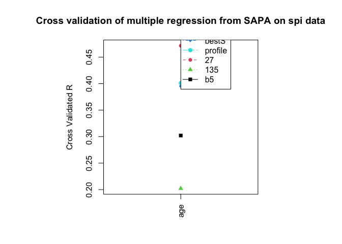

Persome Analyses and Results
================
Elizabeth Dworak

-   [Overview](#overview)
-   [A1. Reliability analyses for the SPI data
    set](#a1-reliability-analyses-for-the-spi-data-set)
    -   [Find alpha and omega for each
        scale](#find-alpha-and-omega-for-each-scale)
    -   [Find the scale scores for the Big 5 and little
        27](#find-the-scale-scores-for-the-big-5-and-little-27)
    -   [Report all the values we just
        calculated.](#report-all-the-values-we-just-calculated)
-   [A2. Regression analyses for the SPI data
    set](#a2-regression-analyses-for-the-spi-data-set)
    -   [Score the items](#score-the-items)
    -   [Split the sample](#split-the-sample)
    -   [Find the multiple correlation](#find-the-multiple-correlation)
    -   [Cross validate](#cross-validate)
    -   [Combine data from the two sets of
        participants](#combine-data-from-the-two-sets-of-participants)
    -   [Find the best items that predict the
        criteria](#find-the-best-items-that-predict-the-criteria)
    -   [Cross validate](#cross-validate-1)
    -   [Look at the outcomes](#look-at-the-outcomes)
        -   [Plot the outcome](#plot-the-outcome)
        -   [Create a table of the
            outcome](#create-a-table-of-the-outcome)
-   [A3. Graphical displays: The Manhattan
    plot](#a3-graphical-displays-the-manhattan-plot)
-   [A4. Studies 3 and 4: Predicting 19 criteria from 696 items and
    scales](#a4-studies-3-and-4-predicting-19-criteria-from-696-items-and-scales)
    -   [Download the SAPA data from
        dataverse](#download-the-sapa-data-from-dataverse)
        -   [Set up R for downloading the
            data](#set-up-r-for-downloading-the-data)
        -   [Pull the data from
            dataverse](#pull-the-data-from-dataverse)
        -   [Remove Temporary Files](#remove-temporary-files)
        -   [If you want, save the files to your working
            directory](#if-you-want-save-the-files-to-your-working-directory)
    -   [Do the analyses](#do-the-analyses)
        -   [Combine the three datasets and pull the scoring
            keys](#combine-the-three-datasets-and-pull-the-scoring-keys)
        -   [If you want, save the files to your working
            directory](#if-you-want-save-the-files-to-your-working-directory-1)
        -   [Score the items](#score-the-items-1)
        -   [Score the items](#score-the-items-2)
        -   [Load in the data](#load-in-the-data)
        -   [Score the data](#score-the-data)
        -   [Cross validate](#cross-validate-2)
        -   [Plot the results](#plot-the-results)
        -   [Plot the correlations](#plot-the-correlations)
-   [A5. Study 5: Applying large sample profiles to a smaller
    sample](#a5-study-5-applying-large-sample-profiles-to-a-smaller-sample)
    -   [Replace the criteria label to something more
        appropriate](#replace-the-criteria-label-to-something-more-appropriate)
    -   [Validation with SPI data](#validation-with-spi-data)
    -   [Plot the results](#plot-the-results-1)

# Overview

This repository includes the code provided in the appendix of [Revelle,
Dworak, & Condon (2021)](https://doi.org/10.1016/j.paid.2020.109905) As
of “28 May, 2021”, this repository is a draft.

# A1. Reliability analyses for the SPI data set

``` r
# Load the packages
library(psych) # make this package active
library(psychTools) # make this one active as well
```

For the purpose of making tables for github file, we need to load
tidyverse to make tables more visually pleasing.

``` r
library(tidyverse)
```

## Find alpha and omega for each scale

First find *α* and *ω*<sub>*h*</sub> for each of the Big 5. Then find
*α* for the little 27.

``` r
omA <- omega(spi[selectFromKeys(spi.keys$Agree)],plot=FALSE)
omC <- omega(spi[selectFromKeys(spi.keys$Consc)],plot=FALSE)
omN <- omega(spi[selectFromKeys(spi.keys$Neuro)],plot=FALSE)
omE <- omega(spi[selectFromKeys(spi.keys$Extra)],plot=FALSE)
omO <- omega(spi[selectFromKeys(spi.keys$Open)],plot=FALSE)

omega.h <- c(omA$omega_h,omC$omega_h,omN$omega_h,omE$omega_h,omO$omega_h)
omega.t <- c(omA$omega.tot,omC$omega.tot,omN$omega.tot,omE$omega.tot,omO$omega.tot)
alphas <- c(omA$alpha,omC$alpha ,omN$alpha,omE$alpha,omO$alpha)

omega.df <- data.frame(omgega_total = omega.t,alpha=alphas,omega_h = omega.h)
rownames(omega.df) <- cs(Agreeableness, Conscientiousness, Neuroticism,
                         Extraversion, Openness)
```

## Find the scale scores for the Big 5 and little 27

``` r
spi.scales <- scoreItems(spi.keys,spi) #find scores as well as scale statistics
spi.scores <- data.frame(spi[1:10],spi.scales$scores) #combine demographics and scores
R5<- lowerCor(spi.scores[11:15])
```

    ##       Agree Consc Neuro Extra Open 
    ## Agree  1.00                        
    ## Consc  0.24  1.00                  
    ## Neuro -0.12 -0.19  1.00            
    ## Extra  0.23  0.07 -0.20  1.00      
    ## Open   0.00  0.01 -0.12  0.13  1.00

``` r
basic.stats <- cbind(omega.df,R5)
```

## Report all the values we just calculated.

This output corresponds with the results of Table 2 from [Revelle,
Dworak, & Condon (2021)](https://doi.org/10.1016/j.paid.2020.109905).

``` r
# This code matches what was used in the analyses for the paper. 
# round(basic.stats, 2) 

# This code is just a more visually appealing table of the code above
basic.stats %>% 
  round(., 2) %>% 
  knitr::kable(caption = "Reliabilities and correlations of the Big 5 scales from the `spi` data set. 
               Alpha reliability is on the diagonal of the correlations.")
```

|                   | omgega\_total | alpha | omega\_h | Agree | Consc | Neuro | Extra |  Open |
|:------------------|--------------:|------:|---------:|------:|------:|------:|------:|------:|
| Agreeableness     |          0.91 |  0.87 |     0.61 |  1.00 |  0.24 | -0.12 |  0.23 |  0.00 |
| Conscientiousness |          0.89 |  0.86 |     0.61 |  0.24 |  1.00 | -0.19 |  0.07 |  0.01 |
| Neuroticism       |          0.93 |  0.90 |     0.71 | -0.12 | -0.19 |  1.00 | -0.20 | -0.12 |
| Extraversion      |          0.92 |  0.89 |     0.70 |  0.23 |  0.07 | -0.20 |  1.00 |  0.13 |
| Openness          |          0.88 |  0.84 |     0.72 |  0.00 |  0.01 | -0.12 |  0.13 |  1.00 |

Reliabilities and correlations of the Big 5 scales from the `spi` data
set. Alpha reliability is on the diagonal of the correlations.

# A2. Regression analyses for the SPI data set

If you want to reload the packages, you can, but it’s redundant if
you’re running the data all at once.

``` r
library(psych) #make this package active
library(psychTools) #make this one active as well
```

## Score the items

Use the scales we found with `scoreItems` as predictors in the
regressions. The criteria are the first 10 variables in the `spi` data
set.

``` r
spi.scales <- scoreItems(spi.keys,spi) #find scores as well as scale statistics

sc.demos <- data.frame(spi[1:10],spi.scales$scores) #combine demographics and scores
#sc.demos <-cbind(spi[1:10],sc$scores) #combine with scores with demographics
```

## Split the sample

``` r
set.seed(42) #for reproducible results

ss <- sample(1:nrow(sc.demos),nrow(sc.demos)/2)
```

## Find the multiple correlation

We use `setCor` to find the multiple correlations and beta weights. We
do not plot the results.

``` r
#derivation multiple Rs
sc.5 <- setCor(y=1:10,x=11:15, data=sc.demos[ss,], plot=FALSE)
sc.27 <- setCor(y=1:10,x=16:42, data=sc.demos[ss,], plot=FALSE)
sc.135 <- setCor(y=1:10,x=11:145,data=spi[ss,] ,plot=FALSE)
```

## Cross validate

Then do the cross validation, taking the second random half of the `spi`
data.

``` r
#now cross validate
cv.5 <- crossValidation(sc.5,sc.demos[-ss,])
cv.27 <- crossValidation(sc.27,sc.demos[-ss,])
cv.135 <- crossValidation(sc.135,spi[-ss,])
```

## Combine data from the two sets of participants

``` r
# combine them into one data frame
cross.valid.df <- data.frame(cv5=cv.5$crossV, cv.27=cv.27$crossV, cv135=cv.135$crossV)
cross.valid.df.sorted <- dfOrder(cross.valid.df,1)
```

## Find the best items that predict the criteria

``` r
bs <- bestScales(spi[ss,],criteria=colnames(spi)[1:10], folds=10, n.item=20,
                 dictionary=spi.dictionary,cut=.05)
```

    ## Number of iterations set to the number of folds =  10

``` r
bs.cv <- crossValidation(bs,spi[-ss,])
```

## Cross validate

Then do the cross validation, taking the second random half of the `spi`
data.

``` r
# sort them in ascending order of the Big 5 multiple R
cross.valid.df.bs <- cbind(cross.valid.df,bs=bs.cv$crossV)
cv.df.bs.sorted <- dfOrder(cross.valid.df.bs,1)
```

## Look at the outcomes

### Plot the outcome

This output corresponds with the results of Figure 1 from [Revelle,
Dworak, & Condon (2021)](https://doi.org/10.1016/j.paid.2020.109905).

``` r
par(pty="s")

matPlot(cv.df.bs.sorted[c(2,4,6,8)],minlength=8,
        main="Cross validation of multiple regression on spi data",
        xlas=3, ylab="Cross Validated R", pch=15:19)

legend(1,.6,cs(135,27,bestS,b5),lty=c(3,2,4,1),col=c(3,2,4,1))
```

<!-- -->

Cross validated correlations predicting 10 different criteria. Four
methods of prediction are shown. The Big 5, little 27 and the 135 item
methods represent cross validated multiple regression models. The “best
scales” method was found by adding up unit-weighted scores based upon
those items identified using the `bestScales` function.

### Create a table of the outcome

``` r
bs.spi.smoke <- bs$items$smoke
```

The following code generates latex code that we used in the manuscript.
This is not helpful if you’re trying to just look at the results.

``` r
df2latex(bs.spi.smoke[c(2,3,5)])
```

To get around this, we can just print the results.

Zero order correlations of items from the `spi` that predict smoking and
health. The composites of these items had cross validated predictive
validities of .24 (smoking) and .44 (health). Items were identified
using `bestScales`. Item numbers are from the list of all SAPA items.
Mean correlations are the mean values across all 10 folds of the k-fold
derivation samples. Standard deviations are the standard deviation
across the 10 fold replications.

``` r
# PURPLERABBIT: For some reason this table isn't matching up. Need to talk to Bill about this.
bs.spi.smoke[c(2,3,5)] %>% 
  mutate(mean.r = round(mean.r, 2),
         sd.r = round(sd.r, 2)) %>% 
  rename("mean r" = mean.r,
         "sd r" = sd.r, 
         "Item Content" = item) %>% 
  knitr::kable(caption = "Items predicting smoking form a scale with a cross validated prediction of .24")
```

|         | mean r | sd r | Item Content                                     |
|:--------|-------:|-----:|:-------------------------------------------------|
| q\_1461 |  -0.23 | 0.01 | Never spend more than I can afford.              |
| q\_1867 |  -0.19 | 0.01 | Try to follow the rules.                         |
| q\_1609 |   0.19 | 0.01 | Rebel against authority.                         |
| q\_1624 |  -0.16 | 0.01 | Respect authority.                               |
| q\_1173 |   0.16 | 0.01 | Jump into things without thinking.               |
| q\_369  |  -0.15 | 0.01 | Believe that laws should be strictly enforced.   |
| q\_56   |  -0.15 | 0.01 | Am able to control my cravings.                  |
| q\_1424 |   0.15 | 0.01 | Make rash decisions.                             |
| q\_35   |   0.14 | 0.01 | Act without thinking.                            |
| q\_598  |   0.14 | 0.01 | Do crazy things.                                 |
| q\_736  |  -0.14 | 0.01 | Easily resist temptations.                       |
| q\_1590 |  -0.13 | 0.01 | Rarely overindulge.                              |
| q\_1664 |   0.13 | 0.01 | Seek danger.                                     |
| q\_1462 |  -0.13 | 0.01 | Never splurge.                                   |
| q\_1452 |   0.12 | 0.01 | Neglect my duties.                               |
| q\_4289 |  -0.12 | 0.01 | Trust people to mainly tell the truth.           |
| q\_4223 |  -0.11 | 0.01 | Stop to think things over before doing anything. |

Items predicting smoking form a scale with a cross validated prediction
of .24

We can do the same process with self-rated health. This code didn’t
appear in the manuscript, but it’s part of Table 3.

``` r
bs.spi.health <- bs$items$health

# PURPLERABBIT: For some reason this table isn't matching up. Need to talk to Bill about this.
# Also, highest value isn't .44
bs.spi.health[c(2,3,5)] %>% 
  mutate(mean.r = round(mean.r, 2),
         sd.r = round(sd.r, 2)) %>% 
  rename("mean r" = mean.r,
         "sd r" = sd.r, 
         "Item Content" = item) %>% 
  knitr::kable(caption = "Items predicting self-rated health form a scale with a cross validated prediction of .44") 
```

|         | mean r | sd r | Item Content                                   |
|:--------|-------:|-----:|:-----------------------------------------------|
| q\_2765 |   0.35 | 0.01 | Am happy with my life.                         |
| q\_811  |  -0.34 | 0.01 | Feel a sense of worthlessness or hopelessness. |
| q\_820  |   0.33 | 0.01 | Feel comfortable with myself.                  |
| q\_578  |  -0.33 | 0.01 | Dislike myself.                                |
| q\_1371 |   0.32 | 0.01 | Love life.                                     |
| q\_56   |   0.27 | 0.01 | Am able to control my cravings.                |
| q\_1505 |  -0.26 | 0.01 | Panic easily.                                  |
| q\_4249 |  -0.26 | 0.01 | Would call myself a nervous person.            |
| q\_1024 |  -0.26 | 0.01 | Hang around doing nothing.                     |
| q\_4252 |  -0.25 | 0.01 | Am a worrier.                                  |
| q\_808  |  -0.25 | 0.01 | Fear for the worst.                            |
| q\_1989 |  -0.24 | 0.01 | Worry about things.                            |
| q\_1452 |  -0.24 | 0.01 | Neglect my duties.                             |
| q\_1444 |  -0.23 | 0.01 | Need a push to get started.                    |
| q\_1052 |  -0.23 | 0.01 | Have a slow pace to my life.                   |
| q\_39   |   0.22 | 0.01 | Adjust easily.                                 |
| q\_979  |  -0.21 | 0.01 | Get overwhelmed by emotions.                   |
| q\_736  |   0.21 | 0.01 | Easily resist temptations.                     |
| q\_312  |  -0.21 | 0.00 | Avoid company.                                 |

Items predicting self-rated health form a scale with a cross validated
prediction of .44

# A3. Graphical displays: The Manhattan plot

This output corresponds with the results of Figure 2 from [Revelle,
Dworak, & Condon (2021)](https://doi.org/10.1016/j.paid.2020.109905).

``` r
#Create the labels for the graph
labels <- names(spi.keys)
labels <- abbreviate(labels,minlength=8)

op <- par(mfrow=c(2,3)) #two row by three column display

man <- manhattan(spi,criteria=cs(health,exer,smoke),
                 keys=spi.keys,abs=FALSE,labels=labels)
man <- manhattan(spi,criteria=cs(health,exer,smoke),keys=spi.keys,abs=FALSE,
                 labels=labels,log.p = TRUE,main="")
```

<!-- -->

``` r
op <- par(mfrow=c(1,1)) #put it back to the normal condition
```

A ‘Manhattan’ plot of the item correlations with three criteria: health,
exercise, and smoking organized by scale. The top panel shows the raw
correlations for the items, the bottom panels show the log of the
probability of the correlations. Items are organized by those forming
the Big 5 scales (the first five columns in each panel, and then items
in the little 27.

# A4. Studies 3 and 4: Predicting 19 criteria from 696 items and scales

Before you can do these analyses for the 126K cases in the bigger `sapa`
data set you need to either get the data by [Condon and Revelle
(2015)](https://dataverse.harvard.edu/dataset.xhtml?persistentId=doi:10.7910/DVN/SD7SVE);
[Condon, Roney, Revelle,
2017a](https://dataverse.harvard.edu/dataset.xhtml?persistentId=doi:10.7910/DVN/TZJGAT),
[Condon, Roney, Revelle,
2017b](https://dataverse.harvard.edu/dataset.xhtml?persistentId=doi:10.7910/DVN/GU70EV)
and getting the 3 `.rda` files there. We then stitch these three
together using `rbind` to create the `full.sapa` data. If you do this,
feel free to skip to the analyses code (see “Do the analyses”).
Alternatively, you can use the code below (see “[Download the SAPA data
from
dataverse](http://127.0.0.1:38097/rmd_output/2/#pull-the-data-from-dataverse)”)
to download the data directly into R.

## Download the SAPA data from dataverse

### Set up R for downloading the data

``` r
# Install the dataverse.
require(devtools) # You may need to run install.packages("devtools")
library(devtools)

# You will need to install dataverse if you do not already have it installed
# install_version("dataverse", version = "0.2.0", repos = "http://cran.us.r-project.org")

# Load the appropriate packages
library(psych)
library(data.table)
library(dataverse)
```

### Pull the data from dataverse

We’ll use the code below to the publicly-available SAPA data.

``` r
# Load SAPA data from 08 Dec 2013 to 26 Jul 2014
dataset1 <- get_dataset("doi:10.7910/DVN/SD7SVE")
writeBin(get_file("sapaTempData696items08dec2013thru26jul2014.tab", 
                  "doi:10.7910/DVN/SD7SVE"), 
         "sapaTempData696items08dec2013thru26jul2014.tab")

sapaTempData696items08dec2013thru26jul2014 <- fread(
  "sapaTempData696items08dec2013thru26jul2014.tab", 
  na.strings=getOption("<NA>","NA"))

sapaTempData696items08dec2013thru26jul2014 <- as.data.frame(sapaTempData696items08dec2013thru26jul2014)

# Load SAPA data from 26 Jul 2014 to 22 Dec 2015
dataset2 <- get_dataset("doi:10.7910/DVN/GU70EV")
writeBin(get_file("sapaTempData696items26jul2014thru22dec2015.tab", 
                  "doi:10.7910/DVN/GU70EV"), 
         "sapaTempData696items26jul2014thru22dec2015.tab")

sapaTempData696items26jul2014thru22dec2015 <- fread(
  "sapaTempData696items26jul2014thru22dec2015.tab", 
  na.strings=getOption("<NA>","NA"))

sapaTempData696items26jul2014thru22dec2015 <- as.data.frame(sapaTempData696items26jul2014thru22dec2015)

# Load SAPA data from 22 Dec 2015 to 07 Feb 2017
dataset3 <- get_dataset("doi:10.7910/DVN/TZJGAT")
writeBin(get_file("sapaTempData696items22dec2015thru07feb2017.tab",
                  "doi:10.7910/DVN/TZJGAT"),
         "sapaTempData696items22dec2015thru07feb2017.tab")

sapaTempData696items22dec2015thru07feb2017 <- fread(
  "sapaTempData696items22dec2015thru07feb2017.tab", 
  na.strings=getOption("<NA>","NA"))

sapaTempData696items22dec2015thru07feb2017 <- as.data.frame(sapaTempData696items22dec2015thru07feb2017)


#Import "ItemInfo696" from dataset3 
writeBin(get_file("ItemInfo696.tab", "doi:10.7910/DVN/TZJGAT"), "ItemInfo696.tab")

sapa.icar.dictionary <- fread("ItemInfo696.tab", header=TRUE, na.strings=getOption("<NA>","NA"))

sapa.icar.dictionary <- as.data.frame(sapa.icar.dictionary)

# data.tables can't have rownames, so it shows up as variable V1. Give ItemInfo696 its rownames back.
rownames(sapa.icar.dictionary) <- sapa.icar.dictionary$V1

# Remove the now-superfluous first column.
sapa.icar.dictionary <- sapa.icar.dictionary[,-1]
```

### Remove Temporary Files

``` r
#Delete the files created by the "writeBin" function.
file.remove(c("sapaTempData696items08dec2013thru26jul2014.tab",
              "sapaTempData696items22dec2015thru07feb2017.tab", 
              "sapaTempData696items26jul2014thru22dec2015.tab", 
              "ItemInfo696.tab"))

rm(dataset1, dataset2, dataset3)
```

### If you want, save the files to your working directory

``` r
save(sapaTempData696items08dec2013thru26jul2014, sapaTempData696items26jul2014thru22dec2015, 
     sapaTempData696items22dec2015thru07feb2017, sapa.icar.dictionary, file = "sapa_data.rda")
```

## Do the analyses

### Combine the three datasets and pull the scoring keys

``` r
# get the files from Dataverse and then combine them
full.sapa <- rbind(sapaTempData696items08dec2013thru26jul2014,
                   sapaTempData696items26jul2014thru22dec2015,
                   sapaTempData696items22dec2015thru07feb2017)

sapa <- char2numeric(full.sapa) #convert string character data to numeric data
spi.items <- selectFromKeys(spi.keys)
```

### If you want, save the files to your working directory

``` r
save(sapa, spi.items, file = "sapa_data.rda")
```

### Score the items

First, if you want you and if you are on a Mac, you can set the number
of cores being used

``` r
#set the number of multiple cores to take advantage of them
#does not work on PCs
options("mc.cores" = 4)
```

After deciding whether or not to change the number of cores you’re
using, you can find the scale scores and reliabilities.

``` r
#find the scale scores and reliabililties
sapa.spi <- scoreItems(spi.keys,sapa,impute="none") 
spi.scores <- sapa.spi$scores
demos <- sapa[c(2:10,14:23)] #choose the 19 demographic data
demos.spi <- cbind(demos,spi.scores)
```

### Score the items

``` r
set.seed (42) # for reproducible results

ss <- sample(1:nrow(demos.spi),nrow(demos.spi)/2)
demos.b5 <- setCor(y=1:19,x=20:24,data=demos.spi[ss,],
                   plot=FALSE) #do the multiple regressions
summary(demos.b5)
```

    ## 
    ## Multiple Regression from raw data 
    ## setCor(y = 1:19, x = 20:24, data = demos.spi[ss, ], plot = FALSE)
    ## 
    ## Multiple Regression from matrix input 
    ## 
    ## Beta weights 
    ##             gender* relstatus*    age marstatus*  height     BMI  weight
    ## (Intercept)   0.000     0.0000  0.000      0.000  0.0000  0.0000  0.0000
    ## Agree         0.133    -0.0815  0.129      0.052 -0.0773  0.0472  0.0033
    ## Consc         0.079    -0.0966  0.081      0.045 -0.0683  0.0323 -0.0038
    ## Neuro         0.169     0.0211 -0.118     -0.041 -0.1342 -0.0027 -0.0664
    ## Extra         0.020    -0.0241 -0.051     -0.024  0.0036 -0.0241 -0.0184
    ## Open         -0.068    -0.0043  0.065      0.032  0.0761  0.0105  0.0457
    ##                exer* smoke* education* jobstatus* occPrestige occIncomeEst
    ## (Intercept)  0.00000  0.000      0.000      0.000      0.0000       0.0000
    ## Agree        0.00093 -0.033      0.089      0.074      0.0151      -0.0033
    ## Consc        0.05284 -0.065      0.043      0.074     -0.0098      -0.0220
    ## Neuro       -0.09189  0.020     -0.092     -0.076     -0.1004      -0.1148
    ## Extra        0.09204  0.035     -0.040     -0.015     -0.0715      -0.0486
    ## Open         0.03890  0.052      0.089      0.054      0.0901       0.0961
    ##              p1edu* p1occPrestige p1occIncomeEst  p2edu* p2occPrestige
    ## (Intercept)  0.0000       0.00000         0.0000  0.0000        0.0000
    ## Agree       -0.0050      -0.00247        -0.0095 -0.0076       -0.0086
    ## Consc       -0.0582      -0.02412        -0.0204 -0.0661       -0.0335
    ## Neuro       -0.0017       0.00057        -0.0064  0.0019       -0.0058
    ## Extra        0.0346       0.01541         0.0209  0.0348        0.0200
    ## Open         0.0399       0.02088         0.0135  0.0355        0.0257
    ##             p2occIncomeEst
    ## (Intercept)         0.0000
    ## Agree              -0.0141
    ## Consc              -0.0247
    ## Neuro               0.0017
    ## Extra               0.0264
    ## Open                0.0116
    ## 
    ## Multiple R 
    ##        gender*     relstatus*            age     marstatus*         height 
    ##          0.238          0.143          0.218          0.094          0.185 
    ##            BMI         weight          exer*         smoke*     education* 
    ##          0.064          0.082          0.159          0.099          0.171 
    ##     jobstatus*    occPrestige   occIncomeEst         p1edu*  p1occPrestige 
    ##          0.151          0.148          0.156          0.079          0.036 
    ## p1occIncomeEst         p2edu*  p2occPrestige p2occIncomeEst 
    ##          0.034          0.083          0.048          0.041 
    ## 
    ## Multiple R2 
    ##        gender*     relstatus*            age     marstatus*         height 
    ##         0.0568         0.0203         0.0476         0.0089         0.0344 
    ##            BMI         weight          exer*         smoke*     education* 
    ##         0.0041         0.0068         0.0252         0.0099         0.0294 
    ##     jobstatus*    occPrestige   occIncomeEst         p1edu*  p1occPrestige 
    ##         0.0227         0.0220         0.0243         0.0062         0.0013 
    ## p1occIncomeEst         p2edu*  p2occPrestige p2occIncomeEst 
    ##         0.0012         0.0069         0.0023         0.0016 
    ## 
    ## Cohen's set correlation R2 
    ## [1] 0.17
    ## 
    ## Squared Canonical Correlations
    ## [1] 0.0764 0.0668 0.0213 0.0128 0.0023 0.0000

``` r
demos.27 <- setCor(y=1:19,x=25:51,data=demos.spi[ss,],plot=FALSE)
demos.135 <-setCor(y =1:19,x=spi.items,data=sapa[ss,],plot=FALSE)

#now cross validate
pred.b5 <- predict.psych(demos.b5,data=demos.spi[-ss,] )
pred.27 <- predict.psych(demos.27,data=demos.spi[-ss,] )
cross.valid.b5 <- diag(cor2(pred.b5,demos.spi[-ss,1:19]))
```

    ##                gender* relstatus*   age marstatus* height   BMI weight exer*
    ## gender*           0.25      -0.07  0.01       0.01  -0.19  0.05  -0.04 -0.04
    ## relstatus*       -0.11       0.14 -0.17      -0.09   0.06 -0.04  -0.01 -0.11
    ## age               0.00      -0.11  0.21       0.10   0.02  0.04   0.04  0.10
    ## marstatus*        0.02      -0.11  0.21       0.10   0.01  0.04   0.04  0.10
    ## height           -0.24       0.05  0.01       0.00   0.19 -0.04   0.05  0.06
    ## BMI               0.12      -0.12  0.18       0.09  -0.08  0.06   0.02  0.04
    ## weight           -0.18      -0.02  0.14       0.06   0.15 -0.01   0.06  0.09
    ## exer*            -0.07      -0.08  0.11       0.06   0.08 -0.01   0.03  0.17
    ## smoke*           -0.09       0.09 -0.12      -0.05   0.08 -0.04   0.00 -0.03
    ## education*       -0.04      -0.09  0.20       0.09   0.05  0.03   0.05  0.10
    ## jobstatus*        0.00      -0.12  0.21       0.10   0.02  0.03   0.04  0.12
    ## occPrestige      -0.16      -0.01  0.14       0.06   0.13  0.00   0.06  0.05
    ## occIncomeEst     -0.19       0.00  0.12       0.05   0.16 -0.01   0.06  0.07
    ## p1edu*           -0.10       0.06 -0.06      -0.03   0.10 -0.03   0.02  0.01
    ## p1occPrestige    -0.09       0.05 -0.06      -0.02   0.09 -0.03   0.02  0.01
    ## p1occIncomeEst   -0.13       0.05 -0.07      -0.03   0.12 -0.05   0.02  0.05
    ## p2edu*           -0.10       0.07 -0.08      -0.04   0.09 -0.03   0.01 -0.01
    ## p2occPrestige    -0.13       0.06 -0.06      -0.03   0.12 -0.04   0.02  0.02
    ## p2occIncomeEst   -0.10       0.07 -0.12      -0.05   0.09 -0.05   0.00  0.02
    ##                smoke* education* jobstatus* occPrestige occIncomeEst p1edu*
    ## gender*         -0.03      -0.02       0.01       -0.08        -0.12  -0.04
    ## relstatus*       0.07      -0.11      -0.13       -0.04        -0.02   0.04
    ## age             -0.06       0.16       0.13        0.12         0.11  -0.02
    ## marstatus*      -0.06       0.16       0.13        0.12         0.10  -0.02
    ## height           0.04       0.04       0.00        0.10         0.13   0.05
    ## BMI             -0.07       0.12       0.11        0.07         0.04  -0.04
    ## weight          -0.01       0.13       0.08        0.15         0.16   0.02
    ## exer*           -0.02       0.09       0.10        0.06         0.08   0.01
    ## smoke*           0.10      -0.05      -0.07       -0.01         0.02   0.08
    ## education*      -0.04       0.16       0.12        0.14         0.13   0.00
    ## jobstatus*      -0.06       0.16       0.14        0.12         0.11  -0.02
    ## occPrestige     -0.01       0.13       0.07        0.15         0.16   0.02
    ## occIncomeEst     0.01       0.12       0.06        0.15         0.17   0.03
    ## p1edu*           0.09      -0.01      -0.04        0.02         0.05   0.08
    ## p1occPrestige    0.10       0.00      -0.04        0.03         0.05   0.08
    ## p1occIncomeEst   0.08      -0.02      -0.04        0.01         0.05   0.08
    ## p2edu*           0.10      -0.03      -0.06        0.01         0.03   0.08
    ## p2occPrestige    0.09      -0.01      -0.04        0.03         0.06   0.08
    ## p2occIncomeEst   0.09      -0.06      -0.06       -0.02         0.01   0.07
    ##                p1occPrestige p1occIncomeEst p2edu* p2occPrestige p2occIncomeEst
    ## gender*                -0.02          -0.02  -0.04         -0.02          -0.01
    ## relstatus*              0.02           0.02   0.04          0.01           0.01
    ## age                    -0.01          -0.02  -0.02          0.00           0.00
    ## marstatus*             -0.01          -0.02  -0.02          0.00          -0.01
    ## height                  0.02           0.03   0.05          0.03           0.02
    ## BMI                    -0.02          -0.03  -0.04         -0.01          -0.01
    ## weight                  0.01           0.01   0.03          0.02           0.01
    ## exer*                   0.01           0.02   0.01          0.01           0.01
    ## smoke*                  0.05           0.04   0.08          0.05           0.04
    ## education*              0.00          -0.01   0.00          0.01           0.01
    ## jobstatus*             -0.01          -0.01  -0.02          0.00           0.00
    ## occPrestige             0.01           0.00   0.02          0.02           0.01
    ## occIncomeEst            0.02           0.01   0.04          0.02           0.01
    ## p1edu*                  0.05           0.04   0.08          0.05           0.04
    ## p1occPrestige           0.05           0.04   0.08          0.05           0.04
    ## p1occIncomeEst          0.04           0.05   0.08          0.05           0.03
    ## p2edu*                  0.04           0.04   0.08          0.05           0.04
    ## p2occPrestige           0.05           0.04   0.08          0.05           0.04
    ## p2occIncomeEst          0.04           0.05   0.07          0.04           0.03

``` r
cross.valid.l27 <- diag(cor2(pred.27,demos.spi[-ss,1:19]))
```

    ##                gender* relstatus*   age marstatus* height   BMI weight exer*
    ## gender*           0.39      -0.19  0.08       0.07  -0.29  0.15   0.01 -0.06
    ## relstatus*       -0.16       0.24 -0.38      -0.21   0.08 -0.16  -0.11 -0.17
    ## age               0.04      -0.17  0.44       0.16   0.05  0.11   0.12  0.15
    ## marstatus*        0.06      -0.21  0.43       0.21   0.02  0.13   0.12  0.16
    ## height           -0.38       0.17 -0.02      -0.05   0.30 -0.11   0.04  0.08
    ## BMI               0.11      -0.16  0.25       0.14  -0.03  0.34   0.30 -0.04
    ## weight           -0.15      -0.05  0.23       0.11   0.18  0.26   0.32  0.01
    ## exer*            -0.14       0.02  0.13       0.02   0.10 -0.09  -0.03  0.26
    ## smoke*            0.02       0.00 -0.03       0.08  -0.01  0.04   0.03 -0.01
    ## education*        0.00      -0.11  0.36       0.13   0.08  0.01   0.05  0.16
    ## jobstatus*        0.02      -0.18  0.45       0.21   0.06  0.17   0.18  0.19
    ## occPrestige      -0.15       0.02  0.24       0.07   0.18 -0.10  -0.01  0.14
    ## occIncomeEst     -0.20       0.03  0.21       0.04   0.21 -0.13  -0.03  0.16
    ## p1edu*           -0.10       0.14 -0.17      -0.11   0.11 -0.18  -0.10  0.01
    ## p1occPrestige    -0.11       0.14 -0.14      -0.07   0.11 -0.19  -0.12  0.05
    ## p1occIncomeEst   -0.15       0.14 -0.13      -0.04   0.14 -0.13  -0.06  0.05
    ## p2edu*           -0.08       0.13 -0.18      -0.11   0.09 -0.19  -0.12  0.02
    ## p2occPrestige    -0.15       0.15 -0.12      -0.07   0.15 -0.14  -0.06  0.01
    ## p2occIncomeEst   -0.15       0.17 -0.20      -0.08   0.11 -0.11  -0.05 -0.01
    ##                smoke* education* jobstatus* occPrestige occIncomeEst p1edu*
    ## gender*          0.00       0.05       0.05       -0.12        -0.18  -0.12
    ## relstatus*      -0.03      -0.32      -0.27       -0.05         0.00   0.10
    ## age             -0.03       0.38       0.26        0.13         0.12  -0.06
    ## marstatus*       0.05       0.37       0.27        0.13         0.09  -0.08
    ## height           0.02       0.01      -0.01        0.12         0.18   0.14
    ## BMI              0.07       0.13       0.17       -0.04        -0.05  -0.13
    ## weight           0.08       0.14       0.16        0.04         0.07  -0.04
    ## exer*           -0.02       0.13       0.11        0.02         0.04   0.05
    ## smoke*           0.23      -0.02      -0.03        0.05         0.01   0.01
    ## education*      -0.05       0.39       0.20        0.20         0.20   0.02
    ## jobstatus*       0.03       0.37       0.29        0.13         0.11  -0.09
    ## occPrestige     -0.07       0.31       0.13        0.21         0.25   0.10
    ## occIncomeEst    -0.06       0.28       0.11        0.22         0.26   0.12
    ## p1edu*          -0.03      -0.04      -0.11        0.05         0.09   0.21
    ## p1occPrestige    0.00      -0.03      -0.09        0.05         0.12   0.22
    ## p1occIncomeEst   0.04      -0.05      -0.06        0.06         0.13   0.19
    ## p2edu*          -0.04      -0.06      -0.11        0.03         0.07   0.21
    ## p2occPrestige    0.04      -0.04      -0.06        0.04         0.08   0.19
    ## p2occIncomeEst   0.11      -0.13      -0.09       -0.01         0.02   0.18
    ##                p1occPrestige p1occIncomeEst p2edu* p2occPrestige p2occIncomeEst
    ## gender*                -0.06          -0.04  -0.11         -0.12          -0.08
    ## relstatus*              0.03           0.05   0.05          0.01           0.00
    ## age                    -0.03          -0.05   0.00          0.04           0.05
    ## marstatus*             -0.02          -0.06  -0.04          0.03           0.04
    ## height                  0.07           0.05   0.13          0.12           0.09
    ## BMI                    -0.04          -0.05  -0.12         -0.12          -0.10
    ## weight                  0.01          -0.01  -0.03         -0.03          -0.04
    ## exer*                   0.05           0.03   0.07          0.05           0.05
    ## smoke*                  0.02           0.02  -0.04         -0.03           0.00
    ## education*              0.00          -0.02   0.09          0.10           0.10
    ## jobstatus*             -0.02          -0.04  -0.04          0.01           0.02
    ## occPrestige             0.02           0.00   0.17          0.18           0.15
    ## occIncomeEst            0.03           0.01   0.18          0.18           0.15
    ## p1edu*                  0.08           0.08   0.24          0.12           0.09
    ## p1occPrestige           0.08           0.08   0.25          0.15           0.11
    ## p1occIncomeEst          0.08           0.08   0.22          0.11           0.08
    ## p2edu*                  0.08           0.08   0.24          0.12           0.09
    ## p2occPrestige           0.07           0.07   0.21          0.12           0.09
    ## p2occIncomeEst          0.09           0.09   0.17          0.07           0.04

### Load in the data

This step may not be necessary if you have followed the code above to
create the `sapa` object

``` r
sapa <- read.file() #goes to my directory to find the file
load(sapa) #one extra step required
sapa <- char2numeric(sapa) #makes the fields numeric
```

### Score the data

``` r
criteria <- colnames(sapa)[c(2:10,14:23)] #choose 19 criteria
spi.items <- selectFromKeys(spi.keys)
```

First, if you want you and if you are on a Mac, you can set the number
of cores being used.

``` r
options("mc.cores"=8) #I am using a mac with multiple cores
```

``` r
scores <- scoreIrt.2pl(spi.keys,sapa) # do IRT scoring of the data

big.scores <- cbind(sapa[criteria],scores)
```

### Cross validate

``` r
set.seed(42) # for reproducible results
ss <- sample(1:nrow(big.scores),nrow(big.scores)/2)

#derivation multiple Rs
sc.5 <- setCor(y=criteria,x=20:24, data=big.scores[ss,], plot=FALSE)
sc.27 <- setCor(y=criteria,x=25:51, data=big.scores[ss,], plot=FALSE)
sc.135 <- setCor(y=criteria, x=spi.items,data=sapa[ss,] ,plot=FALSE)

#now cross validate
cv.5 <- crossValidation(sc.5,big.scores[-ss,])
cv.27 <- crossValidation(sc.27,big.scores[-ss,])
cv.135 <- crossValidation(sc.135,sapa[-ss,])

cross.valid.df <- data.frame(cv5=cv.5$crossV, cv.27=cv.27$crossV,
                             cv135=cv.135$crossV)
cross.valid.df.sorted <- dfOrder(cross.valid.df,1)

#ItemInfo is a dictionary of all of the sapa items
#this information is also on DataVerse
ItemInfo <- sapa.icar.dictionary
bs.sapa<- bestScales(sapa[ss,],criteria=criteria, folds=10, n.item=20,
                     dictionary=ItemInfo[,1:2],cut=.05)
```

    ## Number of iterations set to the number of folds =  10

``` r
bs.cv <- crossValidation(bs.sapa,sapa[-ss,])

#combine the best scales
cross.valid.df <- data.frame(cv5=cv.5$crossV, cv.27=cv.27$crossV,
                             cv135=cv.135$crossV, cvbs= bs.cv$crossV)

cross.valid.df.sorted <- dfOrder(cross.valid.df, 1)
```

### Plot the results

This output corresponds with the results of Figure 4 from [Revelle,
Dworak, & Condon (2021)](https://doi.org/10.1016/j.paid.2020.109905).

``` r
# PURPLERABBIT: For some reason this table isn't matching up. Need to talk to Bill about this.
# It appears that the order of the x axis is wrong
# When done with the dataverse data, it's missing bestS
par(pty="s")

matPlot(cross.valid.df.sorted[c(2,4,6,8)],
        main="Cross validation of multiple regression on sapa data",
        xlas=3, ylab="Cross Validated R",pch=15:18)

legend(1,.5,cs(bestS,27,135,b5),lty=c(4,2,3,1),col=c(4,2,3,1),pch=c(18,16,17,15))
```

<!-- -->

Predicting 19 criteria from the SAPA set. The lines show the cross
validated regression or fits for regressions using the Big 5 scores, the
little 27 scores, and the 135 items from the `spi.` Also shown are the
cross validated values for the solution the `bestScales` function.

### Plot the correlations

This output corresponds with the results of Figure 5 from [Revelle,
Dworak, & Condon (2021)](https://doi.org/10.1016/j.paid.2020.109905).

``` r
#now try profiles
R.big <- cor(sapa[ss,24:719],sapa[ss,criteria],use="pairwise")
R.pheno <- cor(sapa[ss,criteria],use="pairwise")
R.profile <- cor(R.big)
sapa.pheno.profile <- lowerUpper(R.pheno,R.profile)

par(pty="m")
corPlot(sapa.pheno.profile,xlas=3,main="Phenotypic (lower) and Profile (upper) correlations")
```

<!-- -->

The phenotypic correlations (lower off diagonal) and persome profile
correlations (upper off diagonal) of 19 criteria variables. The persome
profiles are based upon 696 items. The profiles are based upon the
correlations across 696 items and thus the standard error for these
correlations are
$\\sigma\_{r} = \\sqrt{\\frac{1-r^{2}}{694}} &lt; .037$. The standard
error of the phenotypic correlation based upon the sample size and the
correlation and is &lt; .003.

# A5. Study 5: Applying large sample profiles to a smaller sample

## Replace the criteria label to something more appropriate

``` r
#we need to change sex to gender to the next step with the spi
colnames(spi)[2] <- "gender"
colnames(sc.demos)[2] <-"gender"

# The code is breaking here and only pulling age
small.crit <- criteria[criteria %in% colnames(spi)[1:10]] 
R.spi.sapa <- cor(sapa[spi.items],sapa[small.crit],use="pairwise") #these are the profiles

small.5 <- setCor(y=small.crit,x = 20:24, data=big.scores, plot=FALSE)
small.27 <- setCor(y=small.crit,x = 25:51, data=big.scores, plot=FALSE)
small.135 <- setCor(y=small.crit,x=spi.items,data=sapa,plot=FALSE)
small.prof <- R.spi.sapa
small.bs <- bestScales(sapa[c(small.crit,spi.items)],criteria=small.crit, folds=10,
                       n.item=20,dictionary=ItemInfo[,1:2],cut=.05)
```

    ## Number of iterations set to the number of folds =  10

## Validation with SPI data

For the small criteria,find the Big 5, little 27 and 135 regressions and
best scales. We can can do this for the full sample since we are
applying to different sample.

``` r
#now validate with the spi data
valid.5 <- crossValidation(small.5, sc.demos)
valid.27 <- crossValidation(small.27, sc.demos)
valid.135 <- crossValidation(small.135, spi)
valid.bs <- crossValidation(small.bs, spi)
small.prof.valid <- crossValidation(small.prof, spi)
small.valid.df <- data.frame(cv5=valid.5$crossV, 
                             cv.27=valid.27$crossV,
                             cv135=valid.135$crossV,
                             cvbs= valid.bs$crossV,
                             profile = small.prof.valid$crossV)
small.valid.df.sorted <- dfOrder(small.valid.df,1)
```

## Plot the results

This output corresponds with the results of Figure 6 from [Revelle,
Dworak, & Condon (2021)](https://doi.org/10.1016/j.paid.2020.109905).

``` r
par(pty="s")
# PURPLERABBIT: Currently this is only pulling age. There's either an error with criteria on line 482 or I messed up the graph by loading tidyverse
matPlot(small.valid.df.sorted[c(2,4,6,8,10)],
        main="Cross validation of multiple regression from SAPA on spi data",
        xlas=3, ylab="Cross Validated R",pch=15:19)
legend(1,.5,cs(bestS, profile, 27, 135, b5), lty=c(4, 5, 2, 3, 1), col=c(4, 5, 2, 3, 1),
       pch=c(18,19,16,17,15))
```

<!-- -->

Predicting 7 criteria for the `spi` data from the larger SAPA set. The
lines show the cross validated regression or fits for regressions using
the Big 5 scores, the little 27 scores, and the 135 items from the
`spi`. Also shown are the values for the solution the `bestScales`
function as well as the profile scores.
